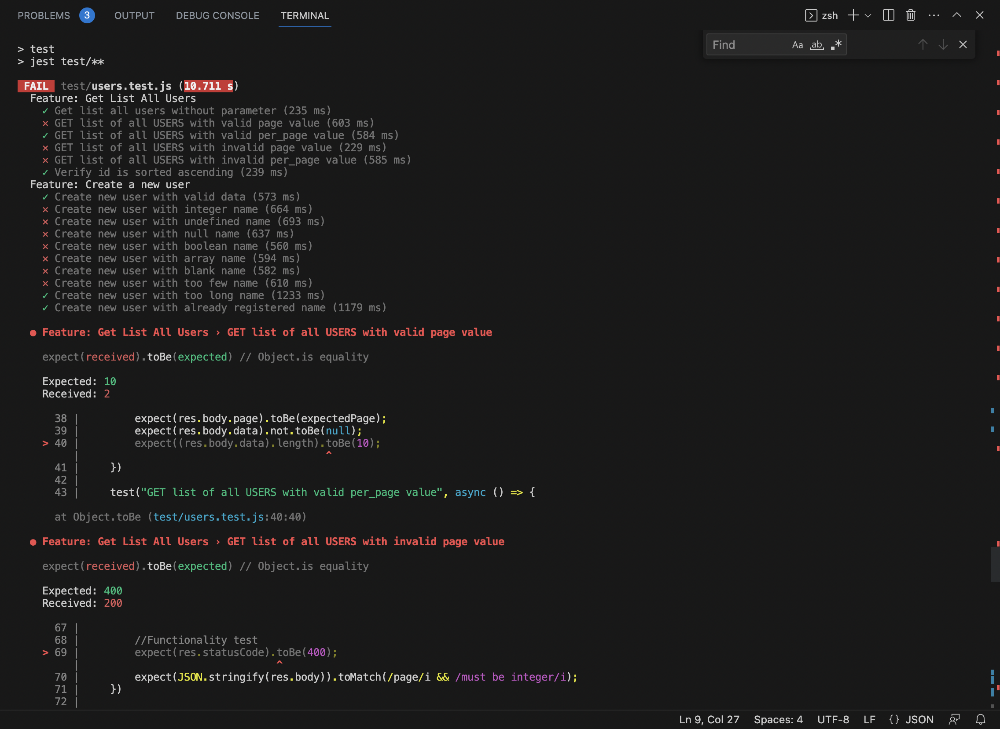
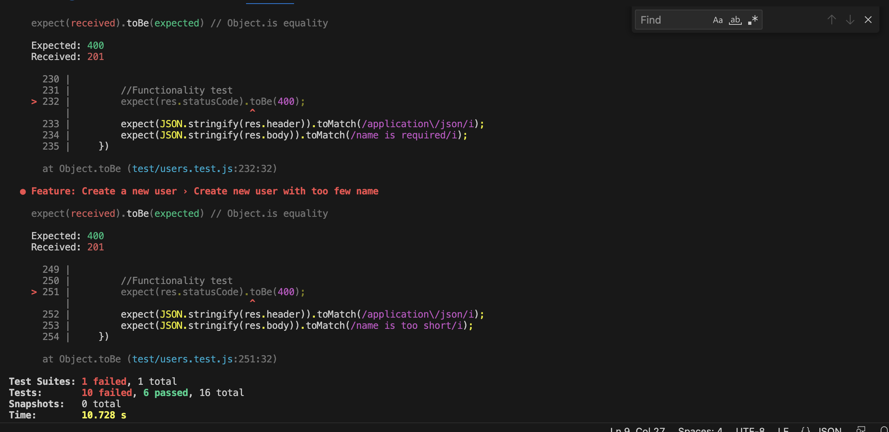
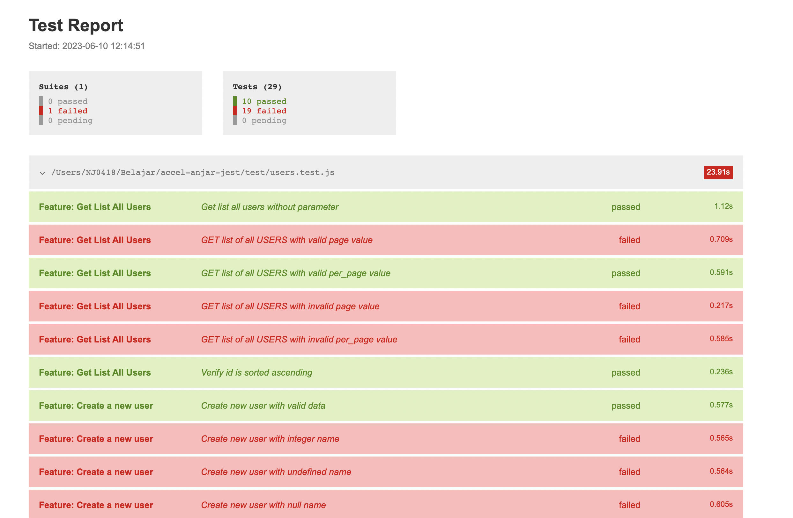

# BOILERPLATE API AUTOMATION TEST USING JEST

This repository provides a boilerplate for API automation testing using JEST framework. It includes the following libraries:

1. [Jest](https://jestjs.io/) - Automation framework for writing and executing tests.
2. [Supertest](https://github.com/visionmedia/supertest) - Library for making HTTP requests and assertions.
3. [Faker](https://github.com/Marak/faker.js) - Library for generating mock data.

The application under test is [reqres.co.in](https://reqres.co.in).

## Covered Endpoints

1. Get List of All Users
2. Create a New User
3. Coming Soon

## How to Use This Repository


### Prerequisites

Make sure you have Node.js and npm (Node Package Manager) installed on your machine. You can download them from the official Node.js website: [https://nodejs.org](https://nodejs.org).

```
node --version
npm --version
```

#### Example Outout

```
node --version
npm --version
```


Ensure the above commands output the installed versions of Node.js and npm, respectively.


### Installation

```bash
git clone https://github.com/AnjarTiyo/boilerplate-jest.git
cd boilerplate-jest
```

### Usage

#### Build depedencies

```
npm install
```

#### Run Test

```
npm run test
```

#### Run Test and generate html report

```
npm run test:report
```

### Result Example





#### Test result example using jest-html-reporter



## Enjoy

That's it! You are now ready to start using this repository for API automation testing using JEST.

Feel free to customize and enhance the tests according to your project requirements.

Happy testing!

Please make sure to update tests as appropriate.


## Contributors

Anjar Tiyo Saputro | [LinkedIn Profile](https://www.linkedin.com/in/anjartiyo)     |

## License

[MIT]('')
